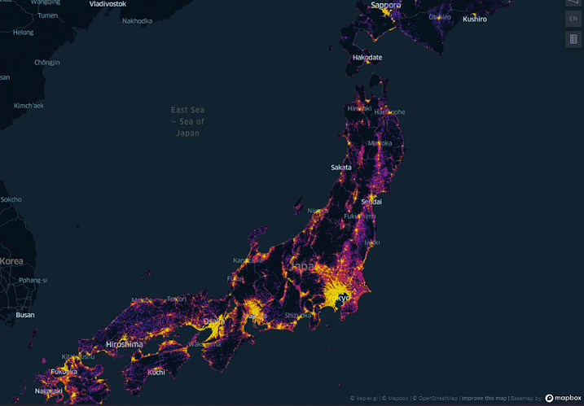

# メッシュ単位の日本の人口分布データ
　日本の人口分布は[政府統計](https://www.e-stat.go.jp/gis/statmap-search?page=1&type=1&toukeiCode=00200521)で公開されています。
ただ、このデータは地域毎で分かれたファイルでしか公開されていないため、それらのファイルを１つに結合したファイルを作りました。公開しているデータなどは、以下の通りです(サイズが大きいGeojsonファイルはリンク先にアップしています)。

- [Japanese_population_mesh_500.geojson](https://www.dropbox.com/scl/fi/iegx4bsnql1n1ftn1on52/Japanese_population_mesh_500.geojson?dl=0&rlkey=odb8bqn2ebkezn6empj8iyumf)

  -- 500メートルメッシュごとの人口分布（総数のみで世帯数などは省略。含まれるデータは、「人口（総数）：T001101001」「メッシュのKEY_CODE」「ポリゴン情報（geometry）」です）
- population_merge.py

   -- ローカルにある政府統計を解凍→結合→境界データとマージするコード
- 元データ
  - [統計地理情報システムの４次メッシュ人口データ（2020年）](https://www.e-stat.go.jp/gis/statmap-search?page=1&type=1&toukeiCode=00200521&toukeiYear=2020&aggregateUnit=H&serveyId=H002005112020&statsId=T001101)
  - [統計地理情報システムの境界データ](https://www.e-stat.go.jp/gis/statmap-search?page=1&type=2&aggregateUnitForBoundary=H&coordsys=1&format=shape)

